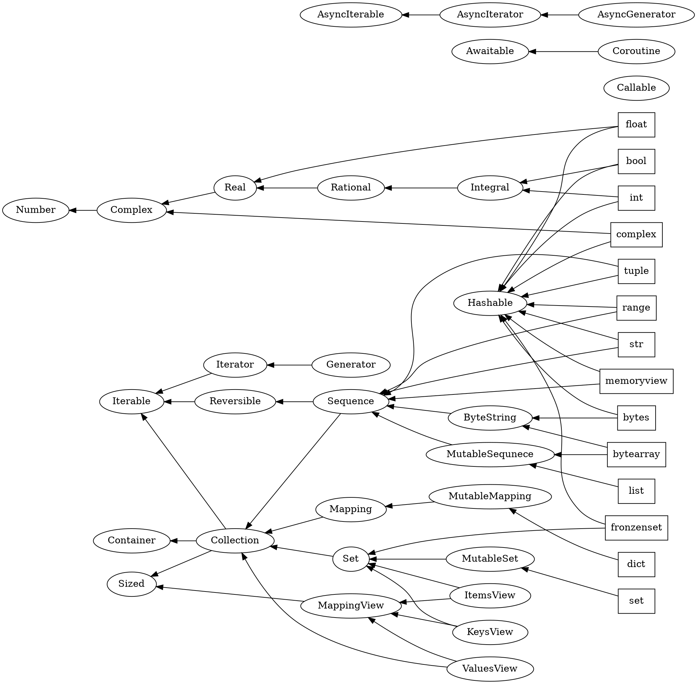
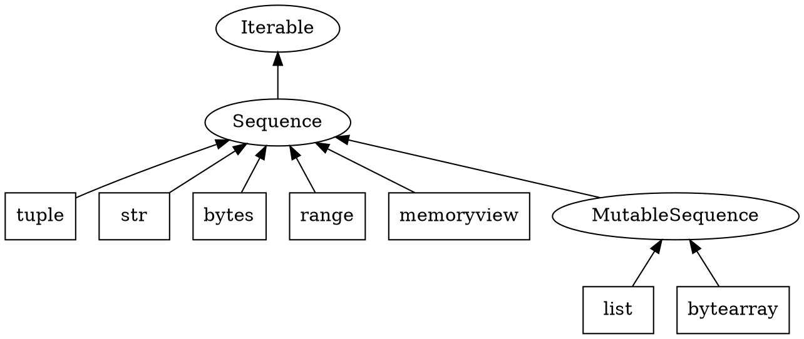
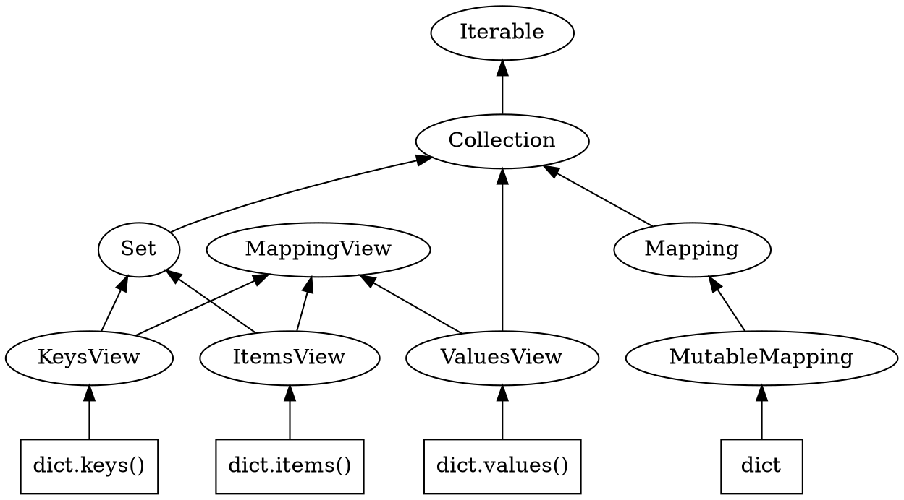
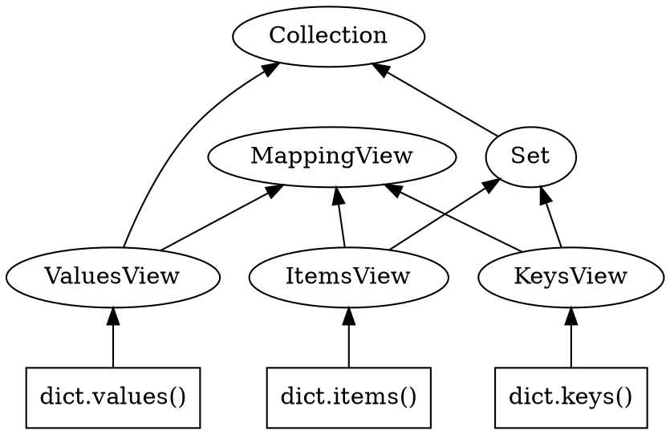
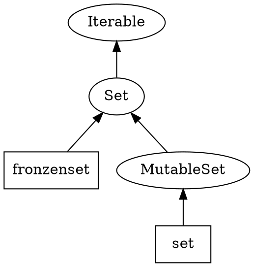

（施工中）

这篇文章是对我们之前所学知识的复习，也教授了一些新的知识，并且提供了一些习题来巩固大家所学的知识。由于我们已经大致掌握了Python命令式编程的设施，这里我就把很多细节补全，并且不再是按照人的学习顺序组织。这篇文章的内容适合不仅适合那些Python新手，也适合已经熟练运用Python的人巩固知识

<!-- more -->

## 1 内置对象

我们可能经常会用到**对象**这个词。按照[Python的官网上的说法](https://docs.python.org/3.7/reference/datamodel.html)，所谓对象就是一个有唯一ID、**值**和**类型**的东西。对象的ID和类型是不会改变的，而根据对象的值能否改变，对象可以分为**可变的（mutable）** 和 **不可变的（immutable）**，这是由它的类型决定的。有些容器如元组，虽然它的内容可能是个可变对象，但我们依旧认为它是个不可变对象。Python中的一切实体都是对象，或者说一切可被赋值给变量的都是对象。而**变量**是一种到对象的**引用**，它将一个对象**绑定**到了名字。当没有任何方法能够获取到某个对象时，那个对象就会被销毁。

Python的类型之间是有父子关系的。子类型会拥有父类型的所有方法。所有的类型都是`object`类型的子类型。比如`int`类型就是`object`类型的子类型，这种父子关系我们称为**继承（inheritance）**，因此我们说`int`类型继承自`object`类型。这里我们还需要引入一个名词叫**实例（instance）**，当我们说对象`a`是类型`A`的实例的时候，其实就在说对象`a`的类型是`A`或者`A`的子类型（包括直接或间接的）。比如`1`是`int`的实例，`'1'`是`str`的实例，而`1`和`'1'`都是`object`的实例，甚至Python中一切的对象都是`object`的实例。

::: tip 面向对象启蒙
面向对象编程启发自大自然。我们就以大自然中的动物为例，每个动物都有一些**属性**，比如性别，同时它们也有一些**方法**，比如繁殖。将这些属性和方法聚集在一起，这就是面向对象的第一个组成部分——**封装（encapsulation）**。而人类和鸟类都继承自动物，因此人类和鸟类都有繁殖这个方法，同时又有性别这个属性，这就是**继承（inheritance）**，面向对象编程的第二个重要组成部分。另一方面，子类型除了能继承父类型的所有方法之外，还能重新定义父类型的方法。比如人类的繁殖是胎生，而鸟类的繁殖就是卵生。这样同样是动物，却对同一个方法有不同的具体行为，这就是**多态（polymorphism）**。多态是面向对象编程的第三个重要组成部分。

最后，我和正在阅读这些文字的你都是人类和动物的**实例（instance）**，是一种**对象（object）**。
:::

下图是一些内置类型的继承关系，其中方框是内置类型，椭圆来自`collection.abc`，每个椭圆的内容都提供一些方法。以后如果有机会，我会再来介绍每个节点是什么含义，你可以点击[此处](https://docs.python.org/3.7/library/collections.abc.html#collections-abstract-base-classes)查看相关文档。



接下来介绍下面2个运算符和4个函数：

- `id(a)`函数：获取对象的ID，这个ID是个整数，而且在对象存在的期间是唯一的（不与其他对象一样）；
- `type(a)`函数：获取对象的类型；
- `a is b`和`a is not b`：判断`a`和`b`是不是同一对象，如果`id(a) == id(b)`，则就认为是同一对象；
- `isinstance(a, A)`：判断对象`a`是否是类型`A`的实例，注意这个运算符与`type(a) is A`还是有区别的比如`isinstance(1, object)`是真，但是`type(1)`是`int`不是`object`。
- `issubclass(A, B)`：判断类型`A`是否是类型`B`的子类型。

下面是例子。

```python
>>> id(1)  # 这个数字是会改变的
139698536331168
>>> type(1) is int  # 最好不要在此处使用 ==
True
>>> a = [1, 2, 3]
>>> b = [1, 2, 3]
>>> a == b
True
>>> a is b  # 对于相同值的可变对象，它们也可能不是同一对象，拥有不同的ID
False
>>> a is not b  # 上面式子的否定
True
>>> isinstance(1, int)
True
>>> isinstance('1', int)
False
>>> isinstance(1, object)
True
>>> isinstance('1', object)
True
>>> issubclass(int, object)
True
```

::: warning
请不要把判断对象相同运算符`is`、`is not`和判断值相等运算符`==`和`!=`搞混。
:::

::: tip
Python中经常有一些函数，其实也是类型，如`str`、`int`等，因为这个类型可以接受参数来实例化出对象，这种函数我们称为**构造函数（constructor）**。
:::

我们将在以后学习自定义的对象和类型，但其实**内置对象**已经足够我们使用。我们先从复习**内置对象**开始。

### 1.1 整数

Python内置支持无限位数的**整数**。它是一种不可变对象。

#### 1.1.1 整数字面量

**整数**的字面量可以是以下几种情况：

- 十进制：非0开头的十进制数，如`127`；
- 二进制：`0b`或`0B`开头的二进制数，如`0b1111111`；
- 八进制：`0o`或`0O`开头的八进制数，如`0o177`；
- 十六进制：`0x`或`0X`开头的十六进制数，使用`a`到`f`或`A`到`F`表示10到15，如`0x7f`。

其中十进制肯定是最常用的，而有时十六进制也很常用，因为2位16进制可以表示一个字节。

整数字面量的进制标识（类似`0x`）和数字以及数字和数字之间都可以加入下线符`_`，如`1_1`、`0x_ff`，而`11_`和`1__1`都是非法的。增加这个语法主要是为了方便很长的数字被阅读，不过这个语法也用得很少。

#### 1.1.2 整数与字符串的转换

`int`是整数的构造函数，它可以从浮点数和字符串中构造出整数：

- 对于参数为浮点数的情况，它会截断（正数是向下取整）；
- 对于参数为字符串的情况，它有第二个参数名叫`base`可以指定进制数，必须是2到36（因为数字+字母总共36个，只能表示36进制），默认为10进制，如果你指定0，则它会从开头的进制标识来推断是几进制。

```python
>>> int(0.9)
0
>>> int(-0.9)
0
>>> int('177')
177
>>> int('177', 8)
127
>>> int('0o177', base=0)
127
```

除了将某进制的字符串转成整型，还可以将整型转成指定进制的字符串。这里Python提供了以下函数：

- `str`：这其实是个通用的构造函数，可以将任意对象转换成字符串，对于整数它会转成10进制。
- `bin`：将整数转成2进制字符串，包含前缀`0b`；
- `oct`：将整数转成8进制字符串，包含前桌`0o`；
- `hex`：将整数转成16进制字符串，包含前缀`0x`。

下面给一些例子：

```python
>>> str(127)
'127'
>>> bin(127)
'0b1111111'
>>> oct(127)
'0o177'
>>> hex(127)
'0x7f'
>>> hex(127)[2:]  # 如果你不想要进制标识，可以用切片语法去除掉
'7f'
```

### 1.2 浮点数

浮点数能存储精度为15位有效数字左右的实数。它是一种不可变对象。

#### 1.2.1 浮点数字面量

浮点数的字面量格式大致如下：

$$\text{整数} \underbrace{. \text{小数}}_{\text{小数部分}} \overbrace{\text{e(或E)} \pm \text{指数}}^{\text{指数部分}}$$

它表示的数字其实就是：$\text{整数}.\text{小数}\times 10^{\text{指数}}$。这里整数、小数和指数可以是任意十进制数字，数字和数字之间可以插入`_`（但同样不常用）。浮点数的字面量可以省略一些部分，但必须满足如下规则：

- 整数和小数可以省略，但不可以同时省略：`1.e-2`和`.5e6`都是合法的浮点数，但是`.e-2`都不是合法的。
- 小数部分和指数部分可以省略，但不可以同时省略：`1e2`和`1.0`都是合法的浮点数，但`1`不是，实际上它是整数。

为了确保某些字面量是浮点类型，我们经常会加上`.0`，比如`1.0`，`0.0`。

#### 1.2.2 浮点数与字符串的转换

`float`是浮点数的构造函数，它可以从整数和字符串中构造出浮点数。同样地，你可以通过`str`函数将浮点数转成字符串。

#### 1.2.3 浮点数的精度问题

浮点数是有误差的，因此用等于去判断两个浮点数的值是否是相等的是有风险的：

```python
>>> 0.1 + 0.1 + 0.1 == 0.3
False
```

在[上一讲](/2019/11/11/python-tutorial2/#_1-1-3-比较运算符（comparison-operator）)中，我介绍了一种用两数只差小于某个很小的值来判断两个浮点数是否相等的方法。实际上，我后来查阅了一些文档，发现在Python 3.5中[新增](https://docs.python.org/3/whatsnew/3.5.html#pep-485-a-function-for-testing-approximate-equality)了用于判断两个实数是否相近的函数，使用方法如下：

```python
>>> import math
>>> math.isclose(0.1 + 0.1 + 0.1, 0.3)
True
```

#### 1.2.4 特殊的浮点数值

这里我们使用`import`语句导入了一个包，我们会在之后的课程里讲解这些。

注意浮点数的零有正零和负零之分，但是正零和负零是相等的：

```python
>>> +0
0
>>> -0    # 整数只有一种0
0
>>> +0.0
0.0
>>> -0.0  # 浮点数有两种0
-0.0
>>> +0.0 == -0.0  # 但这两种0是相等的。
True
```

此外浮点数还有3个特殊的值：`+inf`、`-inf`和`nan`，分别表示为正无穷、负无穷和不是一个数（not a number）。对于大到超出浮点数表示范围的数，就成了正负无穷。在很多语言包括Python的一些数学库（如numpy）中，浮点数除以0也会得到无穷，这是CPU指令约定成俗的，但是在Python中，它会额外检查除数，遇到0就报除零错误。

```python
>>> 1e1000
inf
>>> float('inf')
inf
>>> import numpy
>>> numpy.float64(1) / 0.0
<stdin>:1: RuntimeWarning: divide by zero encountered in double_scalars
inf
>>> 1.0 / 0.0
Traceback (most recent call last):
  File "<stdin>", line 1, in <module>
ZeroDivisionError: float division by zero
```

如果出现了无穷相除、0相除（Python），或者无穷乘以0这种极限中的不定式的情况，就会产生`nan`值，`nan`很特殊，它是唯一一个不等于自身的浮点数。

```python
>>> inf = float('inf')
>>> inf / inf
nan
>>> nan = float('nan')
>>> nan == nan
False
```

### 1.3 字符串和Bytes

字符串类型用于存储文本数据，而Bytes用于存储二进制数据，它是种不可变对象，也是一种序列。

#### 1.3.1 字符串和Bytes的字面量

字符串和Bytes字面量都可以用一对单引号或双引号括起来，区别在于单引号括住的字符串中的双引号可以不必转义，同样的双引号括住的字符串中的单引号可以不必转义。此外字符串和Bytes也可以用三重引号括起，区别在于单重引号不能包含不加转义的换行和对应的引号，而三重引号则可以。

```python
>>> 'It\'s me.'
"It's me."
>>> "It's me."
"It's me."
>>> '''And then,
... that's you'''
"And then,\nthat's you"
```

字符串和Bytes字面量形式上的差别在于Bytes字面量有前缀`b`或`B`。字符串和Bytes字面量还可以有前缀`r`或`R`表示**原始字符串（raw string）**。前缀的大小写是忽略的，其顺序也是无所谓的。原始字符串中的`\`代表它本身，不再处理转义序列。原始字符串经常出现在Windows路径或者正则表达式中。此外字符串还允许有`f`或`F`前缀表示**格式化字符串**，我们将在以后的章节介绍这种。

#### 1.3.2 转义

下表是可以出现在字符串和bytes字面量中的转义字符列表：

|转义序列|含义|
|:-:|:-|
|`\`紧跟换行|`\`和换行被忽略|
|`\\`|反斜杠符 (\\)|
|`\'`|单引号 (')|
|`\"`|双引号 (")|
|`\a`|ASCII 响铃 (Bell，BEL)|
|`\b`|ASCII 退格 (Backspace，BS)|
|`\f`|ASCII 换页 (Formfeed，FF)|
|`\n`|ASCII 换行 (Linefeed，LF)|
|`\r`|ASCII 回车 (Carriage Return，CR)|
|`\t`|ASCII 水平制表符 (Horizontal Tab，TAB)|
|`\v`|ASCII 垂直制表符 (Vertical Tab，VT)|
|`\ooo`|8进制值为ooo的字符，o代表8进制数位，最多可以有3个数位|
|`\xhh`|16进制值为hh的字符，h代表16进制数位，必须2个数位|

除此之外，字符串还支持了额外的转义，列在了下表中，bytes不支持这些转义：

|转义序列|含义|
|:-:|:-|
|`\N{name}`|名字为`name`的 Unicode 字符|
|`\uxxxx`|16进制值为 xxxx 的16位字符，x表16进制数位，必须4个数位|
|`\Uxxxxxxxx`|16进制值为 xxxxxxxx 的32位字符，x表16进制数位，必须8个数位|

有一些小细节这里提示一下，原始字符串也可以转义引号，但反斜杠符仍会被保留，如`r"\""`是`"\\\""`；原始字符串也不能以反斜杠符结尾。

上面的两张表不必死记硬背，记住个大概就好，其中`\t`（水平制表）、`\r`（回车）、`\n`（换行）和`\xhh`这4种转义序列用得比较多。其中`\r`，我们在涉及文件输入输出时再细细介绍，这里我们给出一些例子：

```python
>>> print('1\t2\n3\t4')
1       2
3       4
>>> '\x0a' == '\n' # 换行符ASCII码为10，十六进制为0a
True
```

#### 1.3.3 字符与整数的转换

每个字符都是拥有一个编码的，字符编码中Unicode是ASCII的拓展，前者包含了我们用到的所有字符，包括中日韩表意文字、emoji等等，而后者只有128个字符，这个字符对应的编码称为**码位（code point）**。我们有两个函数对字符和码位互相转换：

- 通过`ord()`函数我们能获得长度为1的字符串或bytes对应的码位；
- 通过`chr()`函数我们能获得码位对应的长度为1的字符串。

```python
>>> ord('我')
25105
>>> chr(25105)
'我'
```

#### 1.3.4 编码与解码

文本在进行编码后就成了二进制数据，而二进制数据解码之后也就变回了文本。Python提供了负责这两种转化的**方法**（这里方法是指某个对象拥有的函数）：

- `str.encode(encoding='utf-8')`：将文本编码成二进制数据；
- `bytes.decode(encoding='utf-8')`：将二进制数据解码为文本。

编码默认是`utf-8`。对于中国大陆而言，由于Windows大都采用国标码记录中文，也就是`gbk`，所以`gbk`也会比较常见。想看完整的编码列表可以点击[此处](https://docs.python.org/3/library/codecs.html#standard-encodings)。下面给一些例子：

```python
>>> text = '你好世界'
>>> binary = text.encode()
>>> binary
b'\xe4\xbd\xa0\xe5\xa5\xbd\xe4\xb8\x96\xe7\x95\x8c'
>>> binary.decode()
'你好世界'
```

#### 1.3.5 将任何对象转换成字符串

Python提供了两个函数将对象转换为字符串：

- `str()`函数：将对象转成一个适合打印的形式；
- `repr()`函数：将对象转成一个包含很多信息的形式，如果可能，得到的字符串将是可以产生这个对象的Python代码。

可能即使这么说还是不够形象，我们给一个字符串的例子，对于字符串而言`str()`函数就是返回它本身：

```python
>>> print(str('1\t2'))
1       2
>>> print(repr('1\t2'))
'1\t2'
```

其实`print()`函数对于非字符串的对象会调用`str()`函数转换成字符串后再打印。另外我们可以看到，当Python的交互式模式输入的是表达式的时候，Python会调用`repr`函数打印这个表达式的值。

::: tip 原理
实际上`str()`会调用对象的`__str__()`方法，而`repr()`会调用对象的`__repr__()`方法。这些方法是所有对象都有的。

```python
>>> print("1\t2".__str__())
1       2
>>> print("1\t2".__repr__())
'1\t2'
```

:::

#### 1.3.6 作为可迭代对象和序列

关于可迭代对象和序列的介绍可以见[1.5.3 可迭代对象的操作](#_1-5-3-可迭代对象的操作)和[1.5.4 序列的操作](#_1-5-4-序列的操作)。作为不可变的序列，字符串和Bytes只支持获取长度，根据索引或切片获取元素等操作，不支持对索引或切片赋值，也不支持删除索引或切片等操作。

#### 1.3.7 常见的字符串方法

完整的字符串方法列表可以点击[此处](https://docs.python.org/3.7/library/stdtypes.html#string-methods)查看。

判断是否包含子串：

- `str.startswith(prefix)`：判断字符串是否以`prefix`开头；
- `str.endswith(suffix)`：判断字符串是否以`suffix`结尾；
- `str.find(sub)`：寻找字符串中包含子串`sub`的起始索引，如果找不到返回`-1`。

```python
>>> '1234'.startswith('12')
True
>>> '1234'.endswith('12')
False
>>> '1234'.find('23')
1
>>> '1234'.find('32')
-1
```

对字符串做一些变换（返回新的字符串）：

- `str.lower()`：将所有的字母转成小写；
- `str.uppper()`：将所有的字母转成大写；
- `str.strip()`：删除前导和后继空白符。

```python
>>> 'abc'.upper()
'ABC'
>>> '  a\tb\t '.strip()
'a\tb'
```

一些判断字符类型的函数：

- `str.isalpha()`：是否都是英文字母且长度至少为1；
- `str.isdigit()`：是否都是数字且长度至少为1；
- `str.isspace()`：是否是空白字符且长度至少为1。

分割与合并：

- `str.split(sep=None)`：以`sep`为分隔符分割字符串成列表，如果`sep`为`None`，则以空白符分割；
- `str.join(iterable)`：将可迭代对象以`str`为分隔符连接成字符串。

```python
>>> items = '1\t 2\n3'.split()
>>> items
['1', '2', '3']
>>> ','.join(items)
'1,2,3'
```

### 1.4 布尔

布尔对象只有两种值：真和假，分别用两个关键字`True`和`False`表示，它们是布尔类型仅有的两个实例。布尔类型实际上和整数类型比较类似，在绝大多是情况下，`True`和1有同样的表现，而`False`和0有同样的表现。`bool`是布尔类型的构造函数，可以将任意类型转为布尔类型。对于`if`语句和`while`语句中的条件表达式，其值会被转换为`bool`类型。

#### 1.4.1 其他类型转换到布尔类型

通常而言，我们认为以下的值是假的：

- 被定义成假的常量：`None`和`False`；
- 值为0的数值类型：如`0`，`0.0`等；
- 空的容器：`''`，`()`，`[]`，`{}`。

其他情况被认为是真值。

::: tip 原理
实际上，`bool()`会调用对象的`__bool__()`方法。如果这个方法没有定义，它会调用对象的`__len__()`方法看它是否非零，如果这个方法也没有，那这个对象就被认为是真的。
:::

### 1.5 列表和元组

列表和元组都是序列。其中列表是可变对象，而元组是不可变对象。

#### 1.5.1 列表和元组的字面量

::: warning
官方文档里面并没有采用列表字面量和元组字面量的词汇，所以我的说法可能是不标准的。官方采用列表显示（list display）指我这里说的列表字面量。而元组字面量我没有找到专业的名词。
:::

使用中括号`[]`括起，逗号分隔的表达式列表就能表示一个**列表**，最后一个表达式的尾部可以有一个可选的逗号。如果你采用多行来完成列表字面量，很推荐你在最后一个表达式的尾部加上逗号，这样以后你再添加元素会很方便。

```python
>>> list1 = [1, 2, 3, 4]
>>> list2 = [
...     'one',
...     'two',
...     'three',
...     'four',
... ]
>>> empty = []
>>> mono = ['a']
```

类似地，使用圆括号`()`括起，逗号分隔的表达式就能表示一个**元组**，最后一个表达式尾部可以有一个可选的逗号。**当只有一个元素的时候，这个逗号是必须的**，如果不添加逗号，就成了一个加了括号改变优先级的表达式。

```python
>>> (1, 2, 3)
(1, 2, 3)
>>> (1)  # 错误的单元素元组表示方法
1
>>> (1,)
(1,)
>>> ()   # 空元组
()
```

值得一提的是，列表和元组的构造是支持解包语法的，这和我们之前说过的函数解包语法是类似的：

```python
>>> a = [3, 4]
>>> b = [1, 2, *a, *(5, 6), 7]
>>> b
[1, 2, 3, 4, 5, 6, 7]
```

此外，元组的括号在不引起歧义（如赋值语句的右侧）的时候是可以省略的。下方代码中，`b, c = 3, 4`利用了赋值语句左侧如果是多个目标，则右侧的可迭代对象会被展开挨个赋值给目标；最后一行是很Pythonic的交换两个变量。

```python
>>> a = 1, 2
>>> a
(1, 2)
>>> b, c = 3, 4
>>> b
3
>>> c
4
>>> b, c = c, b  # 交换两个变量
```

::: tip
Pythonic是对代码的一种要求，就是代码不仅是语法正确的，而且是遵循了Python的习俗的，容易被人理解的。
:::

::: tip 原理
Python哪些地方元组可以省略括号？就我看到的而言有如下地方：

- 表达式语句（支持解包）；
- 赋值语句右侧（支持解包）；
- 复合赋值语句右侧（不支持解包）；
- `yield`右侧（不支持解包）；
- 下标运算符内（不支持解包）；
- `return`右侧（不支持解包）

其中`yield`语句我们还没学过。
:::

#### 1.5.2 可迭代对象到列表和元组的转换

可迭代对象转成列表和元组可以直接使用列表和元组的构造函数：

```python
>>> list(range(10))
[0, 1, 2, 3, 4, 5, 6, 7, 8, 9]
>>> tuple(range(10))
(0, 1, 2, 3, 4, 5, 6, 7, 8, 9)
```

当你有多个可迭代对象，而你希望把它们拼接在一起，那么解包语法也是一个不错的选择，但注意这么做会把可迭代对象的所有值取出，占耗大量的内存，如果你希望得到一个惰性的迭代器，可以使用`itertools.chain()`：

```python
>>> [*range(5), *range(3)]
[0, 1, 2, 3, 4, 0, 1, 2]
>>> import itertools
>>> list(itertools.chain(range(5), range(3)))
[0, 1, 2, 3, 4, 0, 1, 2]
```

#### 1.5.3 可迭代对象的操作

**可迭代对象**是指能够一次返回一个元素的对象。可迭代对象包括序列如`list`、`str`和`tuple`、`range`，也包括映射`dict`，还有`enumerate`等等。

通过调用内置函数`iter()`可以获取可迭代对象的迭代器。所谓**迭代器**，是能够通过内置函数`next()`不断获取下一个元素的对象，直到抛出`StopIteration`异常终止（异常我们以后会介绍）。迭代器本身也是可迭代对象，调用`iter()`会获得自己，这使得迭代器能出现在可迭代对象出现的地方。一般而言一个迭代器只能使用一遍。如果你需要多遍遍历，你需要用`iter()`获取多个全新的迭代器。我们可以看看示例代码：

```python
>>> iterable = [1, 2]
>>> iterator = iter(iterable)
>>> next(iterator)
1
>>> next(iterator)
2
>>> next(iterator)
Traceback (most recent call last):
  File "<stdin>", line 1, in <module>
StopIteration
>>> iterator = iter(iterable)
>>> iterator is iter(iterator)
True
```

::: tip 原理
这部分内容可能对于初学者过于深奥。请谨慎食用。

`iter()`函数会尝试调用可迭代对象的`iterable.__iter__()`方法获得迭代器；如果这个方法不存在，它会试图创建一个迭代器，这个迭代器会，从0开始用整数调用`iterable.__getitem__()`（基本等价于下标）获取元素直到出现`IndexError`异常。

`next()`函数会调用迭代器的`iterator.__next__()`方法。

:::

以下我们给出可迭代对象支持的操作，除了下面列出的操作，可迭代对象还支持**解包**和用`for`语句遍历：

|操作|结果|来源|
|:-|:-|:-|
|`iter(iterable)`|返回`iterable`的迭代器|`Iterable`要求的方法|
|`min(iterable)`|`iterable`最小的元素|`Iterable`提供的方法|
|`max(iterable)`|`iterable`最大的元素|^^|
|`sorted(iterable)`|返回一个迭代器，是排好序的`iterable`，排序是stable的|^^|
|`sum(iterable, start=0)`|从`start`开始左往右对所有数据求和|^^|
|`all(iterable)`|`iterable`所有元素是否都是真|^^|
|`any(iterable)`|`iterable`是否存在某个元素是真|^^|
|`enumerate(iterable, start=0)`|返回一个迭代器，这个迭代器返回的元素是一个由序号（从`start`开始编号）和原可迭代对象的值组成的二元组，经常被用于`for`循环|^^|
|`map(function, iterable)`|返回一个迭代器，这个迭代器返回的元素是传给`function`得到`True`的元素|^^|
|`filter(function, iterable)`|返回一个迭代器，这个迭代器返回的是传给`iterable`元素给`function`得到的结果|^^|
|`zip(*iterables)`|返回一个迭代器，这个迭代器依次同时取出所有可迭代对象的元素，组成一个元组返回，经常用于`for`循环中|^^|

下面给出一些例子：

```python
>>> a = list(range(5, 10))  # 产生一个5到9的列表
>>> a
[5, 6, 7, 8, 9]
>>> import random
>>> random.shuffle(a)  # 随机打乱这个列表
>>> a
[5, 9, 7, 6, 8]
>>> min(a)
5
>>> max(a)
9
>>> sum(a)
35
>>> list(enumerate(a))  # 由于enumerate返回的是迭代器，所以需要list来转换为列表，下同
[(0, 5), (1, 9), (2, 7), (3, 6), (4, 8)]
>>> for i, v in enumerate(a):  # 这个是enumerate经常被使用的方式
...   print(str(i) + ': ' + str(v))
...
0: 5
1: 9
2: 7
3: 6
4: 8
>>> list(filter(lambda x: x > 6, a))  # 筛选出列表中大于6的元素
[9, 7, 8]
>>> list(map(lambda x: x * 2, a))  # 将列表中所有元素乘以2
[10, 18, 14, 12, 16]
>>> all(map(lambda x: x > 5, a))  # 测试是否所有元素都大于5
False
>>> any(map(lambda x: x > 5, a))  # 测试是否存在元素大于5
True
>>> list(zip(range(5, 10), range(10, 5, -1)))
[(5, 10), (6, 9), (7, 8), (8, 7), (9, 6)]
```

#### 1.5.4 序列的操作

所谓**序列**就是那些能够通过整数索引元素`s[i]`、并能通过`len()`函数获取长度的对象，所有的序列对象一定是**可迭代对象**（在先前的继承图中你可以看到`Sequence`继承自`Iterable`）。**可变的序列**是普通**序列**的子类型，除继承得到的方法之外，更进一步支持了对索引赋值`s[i] = value`、删除索引`del s[i]`和插入元素`s.insert(index, value)`这一些操作。这些继承关系可以用下图表示。



这里这些概念有些复杂，我们把这些操作制作成表格，方便大家理解，而后我们给出示例代码。首先是**序列**的操作列表，`list`、`tuple`、`str`、`bytes`、`bytearray`和`range`都支持下表中的操作：

|操作|结果|注释|来源|
|:-|:-|:-|:-|
|`x in s`|如果`s`的一个元素为`x`，则为`True`否则为`False`|如`str`、`bytes`和`bytearray`的一些序列使用`in`进行子串匹配|`Sequence`提供的方法|
|`x not in s`|如果`s`的一个元素为`x`，则为`False`否则为`True`|^^|^^|
|`s + t`|连接序列`s`和`t`，返回新的序列|这种连接如果需要执行多次会有较高的时间开销|某些序列拥有的额外方法，`range`之类的序列没有|
|`s * n`和`n * s`|重复序列`s` `n`次|如果`n`为负，则当做0处理返回空串，注意`s`中的对象发生的是浅拷贝|^^|
|`s[i]`|第$i$个元素，从0开始计数|如果$i$或$j$是负数，则分别等价于`len(s) + i`或`len(s) + j`，但`-0`仍是`0`|`Sequence`要求的方法|
|`s[i:j]`|找出所有下标$k$满足$k\in[i, j)$|^^|^^|
|`s[i:j:k]`|找出所有下标$x$满足$\exists n\in [0,\frac{j-i}{k}), x=i+nk$|^^|^^|
|`len(s)`|`s`的长度| |^^|
|`iter(s)`|返回`s`的迭代器| |`Sequence`提供的方法|
|`reversed(s)`|返回`s`的反向迭代器| |`Sequence`提供的方法|
|`s.index(x[, i[, j]])`|`x`出现在`s`中的第一次位置的下标，额外的参数基本等价于`s[i:j].index(x)`，找不到会抛出`ValueError`异常| |^^|
|`s.count(x)`|`s`中出现了`x`的总数| |^^|

下面是一些示例代码：

```python
>>> s, t = list(range(5)), list(range(5, 10))
>>> s
[0, 1, 2, 3, 4]
>>> t
[5, 6, 7, 8, 9]
>>> 5 in s
False
>>> 5 not in s
True
>>> s + t
[0, 1, 2, 3, 4, 5, 6, 7, 8, 9]
>>> s * 2
[0, 1, 2, 3, 4, 0, 1, 2, 3, 4]
>>> s[-1]
4
>>> s[::-1]  # 一种颠倒序列的方式
[4, 3, 2, 1, 0]
>>> len(s)
5
>>> list(reversed(s))  # 另一种颠倒序列的方式
[4, 3, 2, 1, 0]
>>> s.index(3)
3
>>> s.count(1)
1
```

对于索引和切片下标值的含义，我们还是祭出下方的这个图，这是字符串`Python`的索引对应的位置。索引从0开始计数，索引6是个非法的索引，它**越界**了。此外还要注意切片是左闭右开的。

```ditaa [render no-separation p-class="text-center"]
 +---+---+---+---+---+---+
 | P | y | t | h | o | n |
 +---+---+---+---+---+---+
   0   1   2   3   4   5   6
  -6  -5  -4  -3  -2  -1
```

接着是**可变序列**的操作列表，`list`和`bytearray`支持下表中的操作。

|操作|结果|注释|来源|
|:-|:-|:-|:-|
|`s[i] = x`|`s`中的第`i`个元素被替换为`x`| |`MutableSequence`要求的方法|
|`s[i:j] = t`|`s`从`i`到`j`（不包括`j`）的切片被替换为序列`t`| |^^|
|`del s[i:j]`|等价于`s[i:j] = []`| |^^|
|`s[i:j:k] = t`|将`s[i:j:k]`中的元素替换为序列`t`|切片和`t`的长度必须相等|^^|
|`del s[i:j:k]`|移除`s[i:j:k]`中的元素| |^^|
|`s.append(x)`|将`x`添加到`s`的末尾，等价于`s[len(s):len(s)] = [x]`| |`MutableSequence`提供的方法|
|`s.clear()`|移除`s`中的所有元素，等价于`del s[:]`|Python 3.3新加入的方法|某些可变序列拥有的额外方法|
|`s.copy()`|创建`s`的浅拷贝，等价于`s[:]`|^^|^^|
|`s.extend(t)`和`s += t`|用序列`t`扩展`s`，等价于`s[len(s):len(s)] = t`| |`MutableSequence`提供的方法|
|`s *= n`|更新`s`的内容重复`n`词|内容会被浅拷贝|某些可变序列拥有的额外方法|
|`s.insert(i, x)`|将`x`插入到`s`下表为`i`的地方，等价于`s[i:i] = [x]`| |`MutableSequence`要求的方法|
|`s.pop([i])`|返回下表为`i`的元素并且移除它，默认`i`为`-1`| |`MutableSequence`提供的方法|
|`s.remove(x)`|移除第一个值等于`x`的元素，没找到时抛出`ValueError`异常| |^^|
|`s.reverse()`|将`s`中的元素倒过来| |^^|

下面是示例代码：

```python
>>> s = list(range(5))
>>> s
[0, 1, 2, 3, 4]
>>> s[0] = 5
>>> s
[5, 1, 2, 3, 4]
>>> s[1:3] = [2, 1]
>>> s
[5, 2, 1, 3, 4]
>>> s[::-1] = s  # 一种原处颠倒序列的方法，和 s[:] = s[::-1] 以及 s.reverse() 等价
>>> s
[4, 3, 1, 2, 5]
>>> del s[::2]  # 删除下标是偶数的元素
>>> s
[3, 2]
>>> s.append(6)
>>> s
[3, 2, 6]
>>> s += [7, 8]
>>> s
[3, 2, 6, 7, 8]
>>> s *= 2
>>> s
[3, 2, 6, 7, 8, 3, 2, 6, 7, 8]
>>> s.pop()
8
>>> s
[3, 2, 6, 7, 8, 3, 2, 6, 7]
>>> s.remove(8)
>>> s
[3, 2, 6, 7, 3, 2, 6, 7]
>>> s.reverse()
>>> s
[7, 6, 2, 3, 7, 6, 2, 3]
```

注意`s * n`以及`s *= n`都是进行浅拷贝，这在二维数组的时候会出现问题，看下面的例子：

```python
>>> s = [[0]] * 3
>>> s
[[0], [0], [0]]
>>> s[0][0] = 1
>>> s
[[1], [1], [1]]
```

如果你想要避免这种情况，建议使用[1.5.5 列表推导式](#_1-5-5-列表推导式)。这里先给出代码：

```python
>>> s = [[0] for _ in range(3)]
>>> s
[[0], [0], [0]]
>>> s[0][0] = 1
>>> s
[[1], [0], [0]]
```

此外`list`还提供了以下方法：

- `list.sort(key=None, reverse=False)`：将列表排序。`key`是一个函数，接受元素，返回排序的键，如果`reverse`为`True`，改为由大到小排序，排序一定是stable的。

示例代码如下：

```python
>>> fruits = ['orange', 'apple', 'banana']
>>> fruits_sorted = fruits[:]
>>> fruits_sorted.sort()  # 普通的排序方法
>>> fruits_sorted
['apple', 'banana', 'orange']
>>> fruits_with_index = list(enumerate(fruits))  # argsort的排序方法
>>> fruits_with_index
[(0, 'orange'), (1, 'apple'), (2, 'banana')]
>>> fruits_with_index.sort(key=lambda x: x[1])
>>> fruits_with_index
[(1, 'apple'), (2, 'banana'), (0, 'orange')]
>>> fruits_argsorted = list(map(lambda x: x[0], fruits_with_index))
>>> fruits_argsorted  # argsort排序完成，得到的结果就是数字。数组是从小到大各个元素的下标
[1, 2, 0]
```

::: tip 原理
获取`s[i]`（包括切片）都会调用`s.__getitem__(i)`，`s[i] = t`会调用`s.__setitem__(i, t)`，而`del s[i]`会调用`s.__getitem__(i)`。实际上如何处理`i`是负数、切片之类的完全有对象`s`掌管。如果`i`不是一个合适的类型，可以抛出`TypeError`异常；对于序列类型，如果`i`越界，可以抛出`IndexError`异常；对于映射类型，如果`i`不存在，可以抛出`KeyError`异常。

`len(s)`会调用`s.__len__()`，这个方法应当返回$geq 0$的整数。

`reversed(s)`会先尝试调用`s.__reversed__()`得到逆序迭代器，如果这个方法不存在，它会试图创建一个迭代器，这个迭代器会，从`s.__len__() - 1`一直递减到0，调用`iterable.__getitem__()`获取元素。
:::

#### 1.5.5 列表推导式

列表推导式是一种创建列表更简介的方式。让我们先以创建一系列的平方数为例：

```python
>>> squares = []
>>> for x in range(10):
...     squares.append(x**2)
...
>>> squares
[0, 1, 4, 9, 16, 25, 36, 49, 64, 81]
```

可以看到这里变量`x`在循环结束之后依旧存在。我们可以用下面不带任何副作用的函数式写法：

```python
squares = list(map(lambda x: x**2, range(10)))
```

但是这种写法**可读性**不是特别高，我们可以用下面的列表推导式的写法：

```python
squares = [x**2 for x in range(10)]
```

**列表推导式**语法上是由一个中括号括住的里面包含一个表达式紧跟`for`子句而后可跟任意数目的`for`和`if`子句。其结果就是一个新的列表，列表里面是在`for`和`if`语句上下文中对表达式求值得到值。

举个例子，下面的列表推导式会结合两个列表中的元素，如果它们是不相同的：

```python
>>> [(x, y) for x in [1,2,3] for y in [3,1,4] if x != y]
[(1, 3), (1, 4), (2, 3), (2, 1), (2, 4), (3, 1), (3, 4)]
```

它和下面的代码是等价的：

```python
>>> combs = []
>>> for x in [1,2,3]:
...     for y in [3,1,4]:
...         if x != y:
...             combs.append((x, y))
...
>>> combs
[(1, 3), (1, 4), (2, 3), (2, 1), (2, 4), (3, 1), (3, 4)]
```

此外列表推导式也可以嵌套：

```python
>>> matrix = [
...     [1, 2, 3, 4],
...     [5, 6, 7, 8],
...     [9, 10, 11, 12],
... ]
>>> [[row[i] for row in matrix] for i in range(4)]
[[1, 5, 9], [2, 6, 10], [3, 7, 11], [4, 8, 12]]
```

这等价于：

```python
>>> transposed = []
>>> for i in range(4):
...     transposed.append([row[i] for row in matrix])
...
>>> transposed
[[1, 5, 9], [2, 6, 10], [3, 7, 11], [4, 8, 12]]
```

又进一步等价于：

```python
>>> transposed = []
>>> for i in range(4):
...     # the following 3 lines implement the nested list comprehension
...     transposed_row = []
...     for row in matrix:
...         transposed_row.append(row[i])
...     transposed.append(transposed_row)
...
>>> transposed
[[1, 5, 9], [2, 6, 10], [3, 7, 11], [4, 8, 12]]
```

### 1.6 字典

字典属于可变映射类型，它可以存储键值对。

#### 1.6.1 字典的字面量

字典的字面量是由一对花括号`{}`，逗号分隔的键值对`key: value`组成，最后一个键值对的末尾可以有逗号`,`，这里`key`和`value`可以是任意表达式，但需要注意`key`表达式的结果一定是**可哈希对象（hashable）**，想知道那些对象是可哈希对象可以查看[本章开头](#_1-内置对象)的那张图，继承自`Hashable`的对象都是可哈希对象，所有的数学类型、元组、字符串、bytes是可哈希的。在Python标准库中不可变对象都是可哈希的，可变对象都不是可哈希的，但实际上可变和可哈希没有必然的联系。

可能大家还是不清楚什么叫“哈希”，哈希的意思是将对象的内容映射到一个整数，这种映射就像一个指纹，这对于哈希表这种数据结构是必须的，而哈希表在存储键值对的数据中有很优秀的性能。

```python
>>> {'a': 1, 1: 'a', ('1', 1): 'a'}
{'a': 1, 1: 'a', ('1', 1): 'a'}
>>> {
...   'a': 1,  # 末尾可以跟逗号
... }
{'a': 1}
>>> {['1', 1]: 'a'}  # 列表不是可哈希对象
Traceback (most recent call last):
  File "<stdin>", line 1, in <module>
TypeError: unhashable type: 'list'
>>> {}  # 空的字典
{}
```

:::tip

所谓可哈希对象必须满足两个条件：

- `hashable.__hash__()`方法返回一个整数，这个整数在对象存在期间不会发生变化。该函数会被内置函数`hash(object)`调用；
- `hashable.__eq__(other)`方法可以判断对象是否相等，对于相等的对象，它们的哈希值必须相等。该函数会被二元运算符`==`调用。

一旦定义了`__hash__()`方法，从逻辑上而言必须定义`__eq__(other)`方法。

对于一个用户自定义的类，默认就是有上述两个方法的，这个时候`x == y`，等价于`x`和`y`就是同一个对象。且这时，`x`和`y`拥有相同的哈希值即`hash(x) == hash(y)`。

如果一个自定义的类覆盖了`__eq__()`方法，却没定义`__hash__()`方法，则其`__hash__`会隐式地成为`None`，这会使得它被`hash()`调用时返回`TypeError`。如果这个类是一个子类，它可以通过`__hash__ = ParentClass.__hash__`沿用父类的哈希方法。

如果一个自定义类想彻底禁用哈希，可以`__hash__ = None`。

:::

此外，字典的字面量中还允许字典的解包语法，这和函数的解包是一样的。

当字典的字面量包含重复的键的时候，后面的那个会起效。

```python
>>> a = {'a': 0, 'b': 1}
>>> b = {**a, 'a': 1}  # 解包
>>> b
{'a': 1, 'b': 1}
>>> {1: 'a', 1.0: 'b'}  # 由于 1 == 1.0 ，后面的键值对会替代前面的
{1: 'b'}
```

从Python 3.7开始，映射的迭代顺序一定遵循插入顺序。

#### 1.6.2 其他构造出字典的方式

`dict`是字典的构造函数。`dict`可以接受其他映射对象构造出一个新的字典，也可以从可迭代对象构造出新的字典，这个可迭代对象的元素是包含键和值的二元素可迭代对象。`dict`还接受关键字参数，可以给先前说的两种构造方式添加新的元素。

当出现重复的键时，后面的有效，由于关键字参数位于最后，所以关键字参数总归有效。我们来看例子：

```python
>>> a = {'a': 0, 'b': 1}
>>> dict(a, a=1)
{'a': 1, 'b': 1}
>>> dict([('a', 0), ('b', 1), ('c', 2)])
{'a': 0, 'b': 1, 'c': 2}
>>> dict(zip(['a', 'b', 'c'], range(3)))
{'a': 0, 'b': 1, 'c': 2}
```

#### 1.6.3 映射的操作



|操作|结果|来源|
|:-|:-|:-|
|`d[k]`|返回键`k`对应的值，如果该值不存在，抛出`KeyError`异常|`Mapping`要求的方法|
|`len(d)`|返回`d`中元素的个数|^^|
|`iter(d)`|返回遍历`d`所有键的迭代器，等价于`iter(d.keys())`|^^|
|`d[k] = v`|将`d[k]`设置为`v`，如果'k'存在会更新，不存在会插入|`MutableMapping`要求的方法|
|`del d[k]`|删除`d[k]`，如果`k`存在会抛出`KeyError`异常|^^|
|`k in d`和`k not in d`|判断键`k`是否存在|`Mapping`提供的方法|
|`d1 == d2`和`d1 != d2`|判断两个字典是否相等，只要有相同的键值对的字典就认为相同，这与插入顺序无关|^^|
|`d.keys()`|返回字典键的视图，这是一个包含了字典所有键的集合，详见[字典的试图](#_1-6-4-字典的视图)|^^|
|`d.items()`|返回字典键值对的试图，这是一个包含了`(key, value)`二元组的集合，详见[字典的试图](#_1-6-4-字典的视图)|^^|
|`d.values()`|返回字典值的试图，这是一个包含了所有值的迭代器，注意`d.values() == d.values()`为`False`|^^|
|`d.get(key, default=None)`|类似`d[key]`，只是如果该值不存在会返回`default`|^^|
|`d.pop(key[, default])`|如果`key`在字典中，移除它并返回，否则返回`default`，如果`default`也没指定，抛出`KeyError`异常|`MutableMapping`提供的方法|
|`d.popitem()`|返回`(key, value)`二元组键值对，并移除它，如果字典空会抛出`KeyError`，对于字典，最后插入的会最先pop出来|^^|
|`d.clear()`|移除字典中所有的元素|^^|
|`d.update([other, ]**kwargs)`|和[其他构造出字典的方式]#_1-6-2-其他构造出字典的方式)类似，只是会保留或者更新字典中的键值对，`other`可以是映射或者包含键值对的可迭代对象，也可以携带关键字参数|^^|
|`d.setdefault(key, default=None)`|等价于`d.get(key, default)`，如果`key`不存在，会执行`d[key] = default`|^^|
|`d.copy()`|返回字典的一个浅拷贝|字典对象的额外方法|

同样的，对于上述操作，我们会给出示例，置于字典的视图，更详细的示例代码会在[字典的试图](#_1-6-4-字典的视图)那一节给出。

```python
>>> d = {'a': 1, 'b': 2}
>>> len(d)
2
>>> list(d)  # 等价于list(d.keys())
['a', 'b']
>>> d['c'] = 3
>>> d
{'a': 1, 'b': 2, 'c': 3}
>>> del d['a']
>>> d
{'b': 2, 'c': 3}
>>> 'a' in d
False
>>> d == {'c': 3, 'b': 2}  # 可以看出顺序并不影响是否相等
True
>>> list(d.items())
[('b', 2), ('c', 3)]
>>> list(d.values())
[2, 3]
>>> d.get('d', 4)
4
>>> d.pop('c', 5)
3
>>> d
{'b': 2}
>>> d.update([('a', 1), ('c', 3)])
>>> d.popitem()  # 最后插入的是('c', 3)，所以它被pop了出来
('c', 3)
>>> d
{'b': 2, 'a': 1}
>>> d.clear()
>>> d
{}
>>> d.setdefault('a', 0)
0
>>> d
{'a': 0}
>>> d.copy()
{'a': 0}
```

::: tip 原理
对于字典`d[k]`的操作，如果字典的子类型实现了`d.__missing__(key)`的方法，当`k`找不到的时候就会调用并返回`d.__missing__(k)`。
:::

#### 1.6.4 字典的视图

`dict.keys()`、`dict.values()`和`dict.items()`返回的是视图对象。它们是**动态的**，也就是说如果字典发生了变化，这些视图也会发生变化。下面这张图是[上面](#_1-6-3-映射的操作)图的子图，显示了各个视图对象的关系。



所有的视图都支持下列操作：

|操作|结果|来源|
|:-|:-|:-|
|`len(view)`|得到字典元素的个数|`MappingView`提供的方法|
|`iter(view)`|按照插入顺序遍历，边遍历边插入删除元素会抛出`RuntimeError`|`ItemsView`、`KeysView`和`ValuesView`提供的方法|
|`x in view`|判断`x`是否是键、值或键值对|^^|

`dict.keys()`返回的对象类似集合，而如果字典的值也是可哈希对象，`dict.items()`返回的对象也类似集合。这里类似集合是指可以用判断是否相等的运算（`==`和`!=`）、判断子集的运算（`<`、`<=`、`>`和`>=`）、交（`&`）、并（`|`）、差（`-`）、对称差（`^`）和`isdisjoint()`。具体集合的操作可以查看[1.7 集合和frozenset](#_1-7-集合和frozenset)。

下面是例子：

```python
>>> dishes = {'eggs': 2, 'sausage': 1, 'bacon': 1, 'spam': 500}
>>> keys = dishes.keys()
>>> values = dishes.values()

>>> # 迭代，会调用iter(values)
>>> n = 0
>>> for val in values:
...     n += val
>>> print(n)
504

>>> # keys和values按照同样的顺序（插入顺序）
>>> list(keys)
['eggs', 'sausage', 'bacon', 'spam']
>>> list(values)
[2, 1, 1, 500]

>>> # 视图对象是动态的，会反映字典的变化
>>> del dishes['eggs']
>>> del dishes['sausage']
>>> list(keys)
['bacon', 'spam']

>>> # 集合操作
>>> keys & {'eggs', 'bacon', 'salad'}
{'bacon'}
>>> keys ^ {'sausage', 'juice'}
{'juice', 'sausage', 'bacon', 'spam'}
```

最后我指出一下，其实视图对象用得最多的地方是`for`循环。如果你只需要遍历键，就可以`for k in d:`（`d`是个字典）或者`for k in d.keys():`；如果只需要遍历值，就可以`for v in d.values():`；如果需要遍历键和值，就可以`for k, v in d.items():`。

#### 1.6.5 字典推导式

与列表类似，字典也有推导式。字典的推导式语法与列表类似，只是使用花括号`{}`括起，单个表达式也变成了`:`分隔的两个表达式：

```python
>>> {x: x**2 for x in (2, 4, 6)}
{2: 4, 4: 16, 6: 36}
```

### 1.7 集合和frozenset

集合是一序列互不相同的可哈希对象组成的无序容器，它们可以被用于测试`in`关系（比一般的序列快），去重，以及进行交并补计算。`set`和`frozenset`的差别在于前者是可变的、不可哈希的，而`frozenset`是不可变的、可哈希的。

#### 1.7.1 集合字面量

集合的字面量和字典的字面量比较类似，都是用一对花括号`{}`括起的，并用逗号分隔的。不同之处是字典是键值对`key: value`组成的一对表达式，而集合则只包含一个表达式：

```python
>>> {1, 3, 2}          # 集合元素迭代的顺序不一定遵循插入顺序
{1, 2, 3}
>>> {1, 1, 3.0, 3, 2}  # 集合会去除掉重复的元素
{1, 2, 3.0}
```

集合字面量同样支持可迭代对象的解包：

```python
>>> a = [1, 2, 3]
>>> b = [2, 3, 4]
>>> {*a, *b}
{1, 2, 3, 4}
```

#### 1.7.2 可迭代对象构与集合和frozenset之间的转换

集合和`frozenset`本身就是可迭代对象，这意味着你获取字典和`frozenset`的迭代器、将他们转换成列表或元组、用`for`循环遍历，具体支持的操作可以看[1.5.3 可迭代对象的操作](#_1-5-3-可迭代对象的操作)，当然仍需要指出**集合和frozenset迭代的顺序不一定遵循插入顺序**。

```python
>>> a = {1, 3, 2}
>>> [2 * i for i in a]
[2, 4, 6]
>>> tuple(a)
(1, 2, 3)
```

另一方面集合`set`和`frozenset`的构造函数可以接受一个可迭代对象，构建出新的集合和`frozenset`对象，其中重复的元素会被消除掉。

```python
>>> a = [1, 2, 3, 2, 1]
>>> set(a)
{1, 2, 3}
>>> frozenset(a)
frozenset({1, 2, 3})
```

所以这两个操作和在一起，先把可迭代对象转成集合，再从集合转换为可迭代对象可以成功地消除重复的元素：

```python
>>> a = [1, 2, 3, 2, 1]
>>> list(set(a))         # 一个典型的去重操作
[1, 2, 3]
```

#### 1.7.3 集合和frozenset的操作



从上图我们可以看到集合和`frozenset`的继承关系，首先我们可以看到**所有集合**都共有的一些操作：

|操作|结果|来源|
|:-|:-|:-|
|`len(s)`|`s`的元素个数|`Set`要求的方法|
|`x in s` / `x not in s`|测试`s`是否包含/不包含`x`|^^|
|`set.isdisjoint(other)`|返回两个集合是否没有相同的元素|`Set`提供的方法|
|`set <= other_set` / `set < other_set` / `set >= other_set` / `set > other_set`|测试`set`是否是`other_set`的子集/真子集/超集/真超集|^^|
|`set | other_set` / `set & other_set` / `set - other_set` / `set ^ other_set`|返回`set`和`other_set`的并集/交集/差集/对称差|^^|
|`issubset(other_iterable)` / `issuperset(other_iterable)`|几乎等价于`set <= other`/`set >= other`|`set`和`frozenset`特有的方法|
|`set.union(*other_iterables)` / `set.intersection(*other_iterables)` / `set.difference(*other_iterables)`|几乎等价于`set | other | ...`/`set & other & ...`/`set - other - ...` |^^|
|`set.symmetric_difference(other_iterable)`|几乎等价于`set ^ other`|^^|
|`set.copy()`|返回`set`的浅拷贝|^^|

这里需要指出交、并、差、对称差这4个操作和子集、超集都有对应的两个版本：运算符和方法。这两个我们说是“几乎”等价的，差别在于运算符版要求操作数必须同样是集合类型的，而方法则可以接受可迭代对象，除此之外，某些方法还接受任意多参数。下面我们即将讲到的可变集合操作也类似。

集合和`frozenset`之间是可以混合运算的，所以我们有`set('abc') == frozenset('abc')`。对于交、并、差、对称差，如果存在混合操作，返回的类型是第一个操作数的类型。

这里我们需要指出，集合之间的`<`，`>`和`==`并不组成全序关系，也就是说可能存在两个集合`a`和`b`，`a < b`、`a > b`和`a == b`都为假，这和我们学习到的实数之类的序的关系是不一样的。

集合的交、并和对称差`&`、`|`、`^`可能对于新手不那么容易记，这3个符号来自于C系语言位运算，和集合运算也恰恰是对应上的。之后我们会在表达式中再次遇到这3个运算符作用在整数上的情况。

接下来我们来看看上面运算的例子：

```python
>>> a = {1, 2, 3}
>>> b = {2, 3, 4}
>>> c = {1, 2, 3, 4}
>>> len(c)
4
>>> a.isdisjoint(b)
False
>>> a < c                 # 真子集
True
>>> a & b                 # 交
{2, 3}
>>> a ^ b                 # 对称差
{1, 4}
>>> c.intersection(a, b)  # a、b和c的交集
{2, 3}
```

上面所讲的是普通集合，也就是集合和`frozenset`都支持的操作。下面我们来讲可变集合，也就是集合`set`支持的操作。

|操作|结果|来源|
|:-|:-|:-|
|`set |= other_set` / `set &= other_set` / `set -= other_set` / `set ^= other_set`|等价于`set = set | other_set`（并）/`set = set & other_set`（交）/`set = set - other_set`（差）/`set = set ^ other_set`（对称差）|`MutableSet`提供的方法|
|`set.update(*other_iterables)` / `set.intersection_update(*other_iterables)` / `set.difference_update(*other_iterables)`|等价于`set = set.union(*other_iterables)`/`set = set.intersection(*other_iterables)`/`set = set.difference(*other_iterables)`|`set`特有的方法|
|`set.symmetric_difference_update(other_iterable)`|等价于`set =set.symmetric_difference(other_iterable)`|^^|
|`set.add(elem)`|向`set`中添加元素`elem`|`MutableSet`要求的方法|
|`set.discard(elem)`|向`set`中移除元素`elem`，如果`elem`不存在不报错|^^|
|`set.remove(eleme)`|从`set`中移除元素`elem`，如果`elem`不存在则抛出`KeyError`错误|`MutableSet`提供的方法|
|`set.pop()`|移除一个元素并返回它|^^|
|`set.clear()`|移除集合中的所有元素|^^|

同样地，我们来看一下例子：

```python
>>> a = {1, 2, 3}
>>> b = {4, 5}
>>> a |= b
>>> a
{1, 2, 3, 4, 5}
>>> a.add(7)
>>> a.discard(6)
>>> a.remove(6)
Traceback (most recent call last):
  File "<stdin>", line 1, in <module>
KeyError: 6
>>> a.pop()
1
>>> a
{2, 3, 4, 5, 7}
>>> a.clear()
>>> a
set()
```

#### 1.7.4 集合推导式

集合的推导式和列表的很像，只是使用了花括号括起：

```python
>>> {x**2 for x in (2, 4, 6)}
{16, 4, 36}
```

### 1.8 复数

### 1.9 slice

### 1.10 range和enumerate

## 2 习题

### 2.1 A+B问题

#### 题目要求

输入两个浮点数，输出它们的和，你可以有适当的输出提示来让用户输入浮点数和显示结果。

#### 样例输入输出

```text
Please input the first real number: 1.2
Please input the second real number: 2.3
1.2 + 2.3 = 3.5
```

#### 提示

- [input()函数](https://docs.python.org/3/library/functions.html#input)用于输入；
- [print()函数](https://docs.python.org/3/library/functions.html#print)用于输出：
- [1.2.2 浮点数与字符串的转换](#_1-2-2-浮点数与字符串的转换)。

#### 答案

::: details 点击查看答案

```python
if __name__ == '__main__':
    a = float(input('Please input the first real number: '))
    b = float(input('Please input the second real number: '))
    print(str(a) + ' + ' + str(b) + ' = ' + str(a + b))
```

:::

### 2.2 判断正负

#### 题目要求

输入一个浮点数，输出它是正数、负数还是0。

#### 样例输入输出

```text
Please input a real number: -1
-1.0 is a negative number
```

#### 提示

- 使用[if语句](https://docs.python.org/3/tutorial/controlflow.html#if-statements)来判断。

#### 答案

::: details 点击查看答案

```python
if __name__ == '__main__':
    number = float(input('Please input a real number: '))
    if number > 0.0:
        print(str(number) + ' is a positive number')
    elif number < 0.0:
        print(str(number) + ' is a negative number')
    else:
        print(str(number) + ' is zero')
```

:::

### 2.3 最大值与最小值

#### 题目要求

输入一系列的浮点数，直到输入为0停止，输出他们的最大值最小值平均数和和。

#### 样例输入输出

```text
Please input a real number (input 0 to stop): 2
Please input a real number (input 0 to stop): 1
Please input a real number (input 0 to stop): 3
Please input a real number (input 0 to stop): 0
The maximum number is 3.0
The minimum number is 1.0
The average number is 2.0
The sum number is 6.0
```

#### 提示

- 使用[while语句](https://docs.python.org/3/tutorial/introduction.html#first-steps-towards-programming)来制造循环；
- 使用[break语句](https://docs.python.org/3/tutorial/controlflow.html#break-and-continue-statements-and-else-clauses-on-loops)来终止循环。
- 使用[max()、min()和sum()函数](#_1-5-3-可迭代对象的操作)，注意`max()`函数既可作用域可迭代对象`max(iterable)`，也可直接比较两个数`max(a, b)`，`min()`函数也同样。

#### 答案

::: details 点击查看答案

对于这道题，我们有两种解法。第一种是存下所有的数字，这种方法的代码较为简短，这里需要额外指出的是如果是空的序列`min()`和`max()`会报错，平均数也有可能除零异常

```python
if __name__ == '__main__':
    numbers = []
    while True:
        number = float(input('Please input a real number (input 0 to stop): '))
        if number == 0:
            break
        numbers.append(number)
    if numbers:
        print('The maximum number is ' + str(max(numbers)))
        print('The minimum number is ' + str(min(numbers)))
        sum_of_numbers = sum(numbers)
        print('The average number is ' + str(sum_of_numbers / len(numbers)))
        print('The sum number is ' + str(sum_of_numbers))
    else:
        print('You entered a empty sequence')
```

另一方式就是，只存放最大值、最小值和和。这样空间性能会比较好，如果有大量的甚至超出内存承受范围的浮点数需要输入，也不会出现问题。

```python
import math

if __name__ == '__main__':
    max1, min1, sum1, n = -math.inf, math.inf, 0.0, 0
    while True:
        number = float(input('Please input a real number (input 0 to stop): '))
        if number == 0:
            break
        max1 = max(max1, number)
        min1 = min(min1, number)
        sum1 += number
        n += 1
    if n:
        print('The maximum number is ' + str(max1))
        print('The minimum number is ' + str(min1))
        print('The average number is ' + str(sum1 / n))
        print('The sum number is ' + str(sum1))
    else:
        print('You entered a empty sequence')
```

:::

### 2.4 判断回文串

#### 题目要求

输入一行字符串，判断是不是回文字符串（正过来和倒过来都一样的字符串），如`abcdcba`就是回文数。

#### 样例输入输出

```text
Please input a line: aba
It is a palindrome
```

#### 提示

- [字符串的切片方法](#_1-5-4-序列的操作)。

#### 答案

::: details 点击查看答案

这道题我们也有几种解法，第一种解法非常简单，使用反向的切片就可以得到原来字符串反过来的字符串。

```python
if __name__ == '__main__':
    line = input('Please input a line: ')
    if line == line[::-1]:
        print('It is a palindrome')
    else:
        print('It is not a palindrome')
```

但是我们会发现这个实现中创建了一个临时字符串，所以第一种改进方法是不再创建这个临时字符串：

```python
if __name__ == '__main__':
    line = input('Please input a line: ')
    for a, b in zip(line, reversed(line)):
        if a != b:
            print('It is not a palindrome')
            break
    else:
        print('It is a palindrome')
```

最后我们还会发现回文字符串多比较了几次，所以稍加改动性能就可以翻倍，这里只改动了第3行：

```python
if __name__ == '__main__':
    line = input('Please input a line: ')
    for a, b, _ in zip(line, reversed(line), range(len(line) // 2)):
        if a != b:
            print('It is not a palindrome')
            break
    else:
        print('It is a palindrome')
```

:::

### 2.5 统计字符数目

#### 题目要求

输入一行字符串，统计英文字符（包括大小写）和数字字符的个数。

#### 样例输入输出

```text
Please input a line: a1h45
Number of alphas is 2
Number of digits is 3
```

#### 提示

- [1.3.7 常见的字符串方法](#_1-3-7-常见的字符串方法)有一些判断字符类型的方法。

#### 答案

::: details 点击查看答案

```python
if __name__ == '__main__':
    line = input('Please input a line: ')
    n_alpha, n_digit = 0, 0
    for char in line:
        if char.isalpha():
            n_alpha += 1
        elif char.isdigit():
            n_digit += 1
    print('Number of alphas is ' + str(n_alpha))
    print('Number of digits is ' + str(n_digit))
```

:::

### 2.6 统计单词数目

#### 题目要求

输入一行字符串，字符串包含若干单词（单词中不包含空白符），单词之间有空白符，统计每个单词出现的个数，并将所有的单词按照字母表顺序排列出来：

#### 样例输入输出

```text
Please input a line: what the fuck does what the fuck mean
does: 1
fuck: 2
mean: 1
the: 2
what: 2
```

#### 提示

- 你应当使用字典之类的类型存储个数；
- 你可以使用`sorted()`函数或`list.sort()`方法。

#### 答案

::: details 点击查看答案

```python
if __name__ == '__main__':
    line = input('Please input a line: ')
    words = line.split()
    counter = {}
    for word in words:
        counter[word] = counter.get(word, 0) + 1
    for key, value in sorted(counter.items()):
        print(str(key) + ': ' + str(value))
```

:::

### 2.7 考拉兹猜想

#### 题目要求

考拉兹猜想，又称为奇偶归一猜想、3n+1猜想、冰雹猜想、角谷猜想、哈塞猜想、乌拉姆猜想或叙拉古猜想，是指对于每一个正整数，如果它是奇数，则对它乘3再加1，如果它是偶数，则对它除以2，如此循环，最终都能够得到1。（来自维基百科）。

$$f(n) = \begin{cases} n/2 &\mbox{if } n \equiv 0 \\ 3n+1 & \mbox{if } n\equiv 1 \end{cases} \pmod{2}$$

我们的目标是输入一个整数，输出考拉兹猜想对应的序列，如输入为6，序列就是6，3，10，5，16，8，4，2，1。

#### 提示

- 你需要熟悉一下数学运算。

#### 样例输入输出

```text
Please input a number: 6
6
3
10
5
16
8
4
2
1
```

#### 答案

::: details 点击查看答案

```python
if __name__ == '__main__':
    num = int(input('Please input a number: '))
    while True:
        print(num)
        if num == 1:
            break
        elif num % 2 == 0:
            num //= 2
        else:
            num = 3 * num + 1
```

:::

### 2.8 快速幂

#### 题目要求

Python内置的`**`运算符其实就是快速幂的一种实现。快速幂是求一个数的整数次方时采用的算法，它的计算方法来源于这个式子：

$$x^n = \begin{cases}
1, & \mbox{if } n = 0 \\
x \, ( x \times x)^{\frac{n - 1}{2}}, & \mbox{if } n \mbox{ is odd} \\
(x \times x)^{\frac{n}{2}} , & \mbox{if } n \mbox{ is even}.
\end{cases}$$

你的目标是输入两个整数$a$和$b$，求$a^b$而不使用`**`运算符。我们强烈建议初学者使用递归来解决，这里给出递归的模板代码：

```python
def power(x, n):
    # Your need to call power inside this function
    pass


if __name__ == '__main__':
    x = int(input('Please input the base: '))
    n = int(input('Please input the exponent: '))
    print(str(x) + '^' + str(n) + ' = ' + str(power(x, n)))
```

#### 样例输入输出

```text
Please input the base: 2
Please input the exponent: 5
2^5 = 32
```

#### 答案

::: details 点击查看答案

```python
def power(x, n):
    if n == 0:
        return 1
    elif n % 2:
        return x * power(x * x, (n - 1) // 2)
    else:
        return power(x * x, n // 2)


if __name__ == '__main__':
    x = int(input('Please input the base: '))
    n = int(input('Please input the exponent: '))
    print(str(x) + '^' + str(n) + ' = ' + str(power(x, n)))
```

:::
