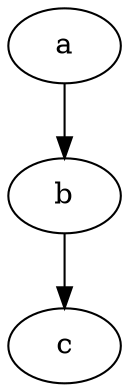

测试各种图。

<!-- more -->

```ditaa [render]
+-------+     +-------+
| hello |--+--| world |
+-------+  |  +-------+
           v
       +--------+
       | Python |
       +--------+
```



```sequence [render]
Andrew->China: Says Hello
Note right of China: China thinks\nabout it
China-->Andrew: How are you?
Andrew->>China: I am good thanks!
```
