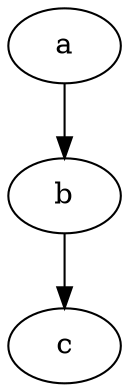

测试各种图。

<!-- more -->

## 1 Ditaa

```ditaa [render p-class="text-center"]
+-------+     +-------+
| hello +--+--+ world |
+-------+  |  +-------+
           v
       +--------+
       | Python |
       +--------+
```

## 2 Graphviz



## 3 Sequence Diagrams

```sequence [render p-class="text-center"]
Andrew->China: Says Hello
Note right of China: China thinks\nabout it
China-->Andrew: How are you?
Andrew->>China: I am good thanks!
```

## 4 Flowchart Diagrams

```flowchart [render p-class="text-center"]
st=>start: Start:>http://www.google.com[blank]
e=>end:>http://www.google.com
op1=>operation: My Operation
sub1=>subroutine: My Subroutine
cond=>condition: Yes
or No?:>http://www.google.com
io=>inputoutput: catch something...
para=>parallel: parallel tasks

st->op1->cond
cond(yes)->io->e
cond(no)->para
para(path1, bottom)->sub1(right)->op1
para(path2, top)->op1
```
