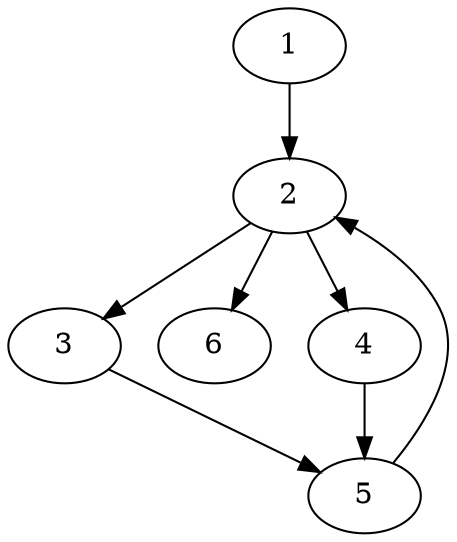
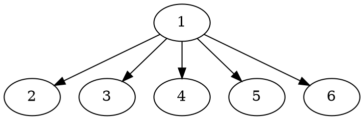

这篇文章是关于如何从非[SSA（静态单一赋值）](https://en.wikipedia.org/wiki/Static_single_assignment_form)形式的[CFG（控制流图）](https://en.wikipedia.org/wiki/Control-flow_graph)构造出SSA形式的控制流图。这主要涉及到图论中的[Dominator理论](https://en.wikipedia.org/wiki/Dominator_(graph_theory))。难点在于$\phi$函数的插入。

<!-- more -->

## 1 简介

SSA中的每个变量仅被定义一次。SSA形式的代码极大地降低了定义使用链的可能数目。在传统的非SSA形式的代码中，如果有$D$处定义和$U$处使用，就可能有$D\times U$种可能的组合。因而SSA形式的代码有利于程序的优化和分析。

顺序执行的代码SSA形式较为简单。但程序会有分支和合并，通过在合并处插入$\phi$函数，就能解决带分支代码的SSA形式。$\phi$函数表示从进来的分支中选取某一个值作为新的值。如下面的代码：

```c
if (p)
  v = 1;
else
  v = 2;
return v;
```

就会被转化成：

```c
if (p)
  v1 = 1;
else
  v2 = 2;
v3 = phi(v1, v2);
return v3;
```

使用SSA形式中的一个分析例子是常量传播分析。常量传播分析是指分析哪些变量是常量，对于非SSA形式的分析，这较为困难。对于SSA形式，我们可以将那些使用常量定义的变量，将其所有出现的地方替换成常量，不断迭代直到到达不动点即可。

### 1.1 何处安放$\phi$函数

::: tip 图论中的相关概念

<p />

- **支配**：$x$支配$y \Leftrightarrow$ 从起始节点到$y$的每条路径都经过了$x$，记为$x\underline{\gg}y$；从定义来说$\forall x, x$支配$x$；这是一个偏序关系。
- **严格支配**：$x$严格支配$y \Leftrightarrow x$支配$y \land x \neq y$，记为$x\gg y$；如果$x$不严格支配$y$，则记为$x\rlap{\hspace{.6em}|}\gg y$。
- **支配边界**：$y \in x$的支配边界$\Leftrightarrow x$支配了$y$的前驱节点，但$d$没有严格支配$y$；从定义来说$x$可能支配$x$自己；直观理解支配边界就是支配从有到无的界线。
- **立即支配者**：$x$是$y$的立即支配者$\Leftrightarrow x$严格支配$y$且$\forall z$严格支配$y$，$x$不严格支配$z$；我们会用idom来表示立即支配者；直观理解$y$的idom就是离$y$最接近的严格支配$y$的节点；一个节点的idom是唯一的。
- **支配者树**：每个节点的立即支配者组成了一棵树（支配的偏序确保是有向无环的，idom的唯一进而确保是棵树）。

注意支配的概念是对于一个有**起始节点**的有向图的。

例子如下，考虑下面的图：



其支配者树就是：



:::

假设$V$在程序中只有一处赋值。那么$V$的值要么是程序开始处的$V_0$，要么是被赋值后的$V_1$（注：这里可能在原作者[^cytron1991efficiently]眼中所有的变量都是在程序入口处有定义的，见[2 控制流图（CFG）](#_2-控制流图（cfg）)）。假设$X$是给$V$赋值的基本快，那么对于$X$严格支配的基本块$Y$，它见到的值一定是$V_1$。如果控制流跑到了$Z$，而$Z$不被$X$严格支配，且$Z$是这个路径中的第一个，那么$Z$即可能从$X$看到$V_1$又可能从程序开始处看到$V_2$。$Z$被称为$X$的支配边界（dominance frontier），需要添加$\phi$函数。**因此总的来说，我们可以寻找到给$V$赋值的基本块的所有控制边界，它们就是需要插入$\phi$函数的地方。**

## 2 控制流图（CFG）

程序的语句可以被组织成基本块，控制流从基本块的第一个语句进入，到最后一条语句流出。CFG是一个有向图，其节点除了基本块外，还有Entry和Exit节点。Entry到程序的任何入口基本块会有一条边，程序的任何出口到基本块会有一条边。此外还有一条从Entry到Exit的边，原因之后解释。其他的边代表执行流的跳转。一个拥有多个后继的节点称为**分支**，一个拥有多个前驱的节点称为**合并**。每个节点在Entry节点都会有一个赋值，代表程序进入时它的值，这个赋值与其他赋值同等对待。

我们使用$p:X_0\xrightarrow[]{*}X_J$代表一般的路径（可空，长度$J$的路径包含$J+1$个节点和$J$个边），使用$p:X_0\xrightarrow[]{+}X_J$代表非空路径。

对于两个非空路径$p:X_0\xrightarrow[]{+}X_J$和$q:Y_0\xrightarrow[]{+}Y_K$，我们说它们交汇于节点$Z$如果：

$$\begin{cases}
X_0\neq Y_0 \\
X_J = Z = Y_K \\
(X_j = Y_k) \Rightarrow (j = J \lor k = K) \\
\end{cases}$$

直觉来说，就是$p$和$q$从不同的节点出发，然后没有在中间交于相同的节点，只是在最后交于$Z$，然后其中有的边可能包含循环$Z\xrightarrow[]{+}Ｚ$的路径。

## 3 静态单一赋值形式（SSA）

一个赋值语句$A$形如$LHS(A)\rightarrow RHS(A)$。其中$LHS$是一个互异的目标变量元组，而$RHS$是一个表达式元组，两个元组长度相等。语义上，$RHS$中的每一个表达式都赋值给了对应的$LHS$的目标变量。

将程序转换成SSA形式分为两步，首先，一些平凡的$\phi$函数被插入，形如$V\leftarrow\phi(V,V,\dots)$。第二步则是替换所有的$V$为新的变量$V_i$，这里被替换的$V$包括分支语句中出现的和赋值中出现的。因而，本文中，一个赋值可能是个普通赋值或者$\phi$赋值。

先前提到的$\phi$赋值有如下的形式$V\leftarrow\phi(R,S,\dots)$，其中$V,R,S,\dots$是变量，$\phi$赋值位于基本块的开始。右手边变量的个数应当与进入基本块的前驱数目相等，这里要求基本块的前驱以某种形式排序。如果控制流从第$j$个前驱流入，那么$V$的取值就是右手边第$j$个变量。

### 3.1 其他的程序结构

对于数组，将数组元素视为变量会很不方便，因而可以引入两个函数$Access(A, i)$表示访问数组$A$的第$i$个元素，其返回值就是$A$的第$i$个元素的值，$Update(A, j, V)$表示修改数组$A$的第$j$个元素，将其值置为$V$，并返回新的数组$A$。所以对$A$某个元素的赋值相当于对整个数组$A$赋值。

结构体大体上可以看成是数组。

除此之外，可能存在到变量的隐式引用，比如全局变量改变、变量别名、解引用指针等等。对于语句$S$，3中类型的引用影响到了到SSA形式的转换：

- $MustMod(S)$：一定被$S$修改的变量集合；
- $MayMod(S)$：可能被$S$修改的变量集合；
- $MayUse(s)$：在$S$执行之前的值可能被$S$用到的变量集合。

将$S$转化为赋值语句$A$时，$MayMod(S)$中的所有变量应当出现在$LHS(A)$中，$MayUse(S)\cup(MayMod(S)-MustMod(S))$的所有变量出现在$RHS(A)$中。

### 3.2 SSA算法概览

1. 从CFG中构造出控制边界映射；
2. 使用控制边界插入$\phi$函数；
3. 重命名变量。

## 4 控制

下文中，前驱、后继和路径这些名词是CFG上的，而父亲、孩子、祖先、子孙这些名词是指支配者树的。关于支配者树的计算我将在稍后给出。

### 4.1 支配边界

首先我们给出支配边界$DF(X)$的形式化定义：

$$DF(X) = \{Y|\exists P\in Pred(Y)(X\underline{\gg}P\land X\rlap{\hspace{.6em}|}\gg Y)\}$$

直接依据定义计算支配边界会具有很高的复杂度。

[^cytron1991efficiently]: Cytron, R., Ferrante, J., Rosen, B. K., Wegman, M. N., & Zadeck, F. K. (1991). Efficiently computing static single assignment form and the control dependence graph. *ACM Transactions on Programming Languages and Systems (TOPLAS)*, 13(4), 451-490.
[^lengauer1979fast]: Lengauer, T., & Tarjan, R. E. (1979). A fast algorithm for finding dominators in a flowgraph. *ACM Transactions on Programming Languages and Systems (TOPLAS)*, 1(1), 121-141.
