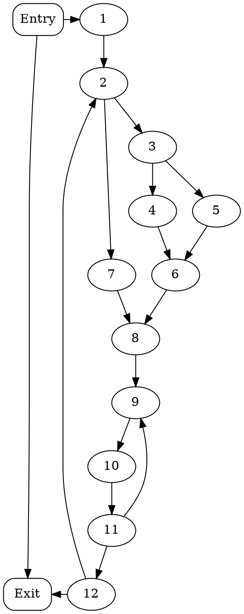
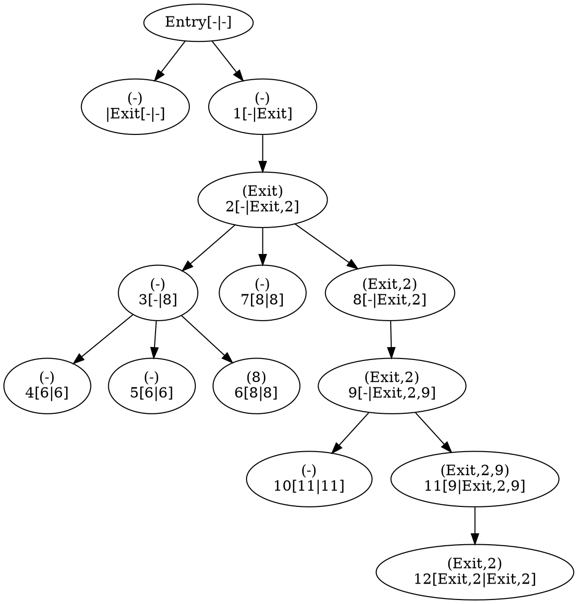

这篇文章是关于如何从非[SSA（静态单一赋值）](https://en.wikipedia.org/wiki/Static_single_assignment_form)形式的[CFG（控制流图）](https://en.wikipedia.org/wiki/Control-flow_graph)构造出SSA形式的控制流图。这主要涉及到图论中的[Dominator理论](https://en.wikipedia.org/wiki/Dominator_(graph_theory))。难点在于$\phi$函数的插入。

<!-- more -->

## 1 简介

SSA中的每个变量仅被定义一次。SSA形式的代码极大地降低了定义使用链的可能数目。在传统的非SSA形式的代码中，如果有$D$处定义和$U$处使用，就可能有$D\times U$种可能的组合。因而SSA形式的代码有利于程序的优化和分析。

顺序执行的代码SSA形式较为简单。但程序会有分支和合并，通过在合并处插入$\phi$函数，就能解决带分支代码的SSA形式。$\phi$函数表示从进来的分支中选取某一个值作为新的值。如下面的代码：

```c
if (p)
  v = 1;
else
  v = 2;
return v;
```

就会被转化成：

```c
if (p)
  v1 = 1;
else
  v2 = 2;
v3 = phi(v1, v2);
return v3;
```

使用SSA形式中的一个分析例子是常量传播分析。常量传播分析是指分析哪些变量是常量，对于非SSA形式的分析，这较为困难。对于SSA形式，我们可以将那些使用常量定义的变量，将其所有出现的地方替换成常量，不断迭代直到到达不动点即可。

### 1.1 何处安放$\phi$函数

假设$V$在程序中只有一处赋值。那么$V$的值要么是程序开始处的$V_0$，要么是被赋值后的$V_1$（注：这里可能在原作者[^cytron1991efficiently]眼中所有的变量都是在程序入口处有定义的，见[2 控制流图（CFG）](#_2-控制流图（cfg）)）。假设$X$是给$V$赋值的基本块，那么对于$X$严格支配的基本块$Y$，它见到的值一定是$V_1$。如果控制流跑到了$Z$，而$Z$不被$X$严格支配，且$Z$是这个路径中的第一个，那么$Z$即可能从$X$看到$V_1$又可能从程序开始处看到$V_2$。$Z$被称为$X$的支配边界（dominance frontier），需要添加$\phi$函数。**因此总的来说，我们可以寻找到给$V$赋值的基本块的所有支配边界，它们就是需要插入$\phi$函数的地方。**

使用支配边界进行SSA计算的这个想法也适用于计算**控制依赖**。**控制依赖**可以确定语句执行的条件。

## 2 控制流图（CFG）

程序的语句可以被组织成基本块，控制流从基本块的第一个语句进入，到最后一条语句流出。CFG是一个有向图，其节点除了基本块外，还有Entry和Exit节点。Entry到程序的任何入口基本块会有一条边，程序的任何出口到基本块会有一条边。此外还有一条从Entry到Exit的边，原因之后解释。其他的边代表执行流的跳转。一个拥有多个后继的节点称为**分支**，一个拥有多个前驱的节点称为**合并**。每个节点在Entry节点都会有一个赋值，代表程序进入时它的值，这个赋值与其他赋值同等对待。

我们使用$p:X_0\xrightarrow{*}X_J$代表一般的路径（可空，长度$J$的路径包含$J+1$个节点和$J$个边），使用$p:X_0\xrightarrow{+}X_J$代表非空路径。

对于两个非空路径$p:X_0\xrightarrow{+}X_J$和$q:Y_0\xrightarrow{+}Y_K$，我们说它们**交汇**于节点$Z$如果：

$$\begin{cases}
X_0\neq Y_0 \\
X_J = Z = Y_K \\
(X_j = Y_k) \Rightarrow (j = J \lor k = K) \\
\end{cases}$$

直觉来说，就是$p$和$q$从不同的节点出发，然后没有在中间交于相同的节点，只是在最后交于$Z$，然后其中有的边可能包含循环$Z\xrightarrow{+}Z$的路径。

## 3 静态单一赋值形式（SSA）

一个赋值语句$A$形如$LHS(A)\leftarrow RHS(A)$。其中$LHS$是一个互异的目标变量元组，而$RHS$是一个表达式元组，两个元组长度相等。语义上，$RHS$中的每一个表达式都赋值给了对应的$LHS$的目标变量。

将程序转换成SSA形式分为两步，首先，一些平凡的$\phi$函数被插入，形如$V\leftarrow\phi(V,V,\dots)$。第二步则是替换所有的$V$为新的变量$V_i$，这里被替换的$V$包括分支语句中出现的和赋值中出现的。因而，本文中，一个赋值可能是个普通赋值或者$\phi$赋值。

先前提到的$\phi$赋值有如下的形式$V\leftarrow\phi(R,S,\dots)$，其中$V,R,S,\dots$是变量，$\phi$赋值位于基本块的开始。右手边变量的个数应当与进入基本块的前驱数目相等，这里要求基本块的前驱以某种形式排序。如果控制流从第$j$个前驱流入，那么$V$的取值就是右手边第$j$个变量。

SSA形式可以被看作一个程序的性质，或者一个从不具备该性质的程序到具备的变换。作为变换，它要求新程序满足以下的性质，对于每一个原始程序的变量$V$：

1. 如果$X\xrightarrow{+}Z$和$Y\xrightarrow{+}Z$交汇于节点$Z$，且$X$和$Y$包含了对$V$的赋值（原始程序中的），$\phi$赋值应当被插入到$Z$中（新程序）；
2. 每一个对$V$的使用（包括$\phi$函数）都被替换为$V_i$，使程序成为静态单一赋值；
3. 沿着任何控制流路径，源程序中的$V$的取值于新程序中的$V_i$的取值必须一样。

**最小SSA形式**是指插入的$\phi$函数尽可能少。一些没有必要的$\phi$函数可能会影响程序的优化。另一种是**修剪的SSA形式**，它是指如果变量没有在交汇点$Z$中及之后使用，就删掉$\phi$语句。不过有时我们会需要在所有交汇的地方放置$\phi$函数，但本文的算法经过微小的改动就可以得到修剪的SSA形式。

### 3.1 其他的程序结构

对于数组，将数组元素视为变量会很不方便，因而可以引入两个函数$Access(A, i)$表示访问数组$A$的第$i$个元素，其返回值就是$A$的第$i$个元素的值，$Update(A, j, V)$表示修改数组$A$的第$j$个元素，将其值置为$V$，并返回新的数组$A$。所以对$A$某个元素的赋值相当于对整个数组$A$赋值。

结构体大体上可以看成是数组。

除此之外，可能存在到变量的隐式引用，比如全局变量被子过程的使用和改变、变量别名、解引用指针等等。对于语句$S$，3中类型的引用影响到了到SSA形式的转换：

- $MustMod(S)$：一定被$S$修改的变量集合；
- $MayMod(S)$：可能被$S$修改的变量集合；
- $MayUse(s)$：在$S$执行之前的值可能被$S$用到的变量集合。

将$S$转化为赋值语句$A$时，$MayMod(S)$中的所有变量应当出现在$LHS(A)$中，$MayUse(S)\cup(MayMod(S)-MustMod(S))$的所有变量出现在$RHS(A)$中（这部分我不太理解）。

对于堆内存的访问，将堆内存视为一整个变量对于大多优化算法足够。如果我们不能获取到函数体，那就要假定所有的全局变量及参数引用的对象会被改变，而调用者的局部变量不应假定为会改变。当然更细致的堆内存模型和别名分析是很有帮助的。更细致的分析可以减少副作用以及减少$LHS$和$RHS$元组的长度。

### 3.2 SSA算法概览

1. 从CFG中构造出支配边界映射；
2. 使用支配边界插入$\phi$函数；
3. 重命名变量。

## 4 支配

### 4.1 支配者树

::: tip 图论中的相关概念

<p />

- **支配**：$x$支配$y \Leftrightarrow$ 从起始节点到$y$的每条路径都经过了$x$，记为$x\underline{\gg}y$；从定义来说$\forall x, x$支配$x$；这是一个偏序关系（满足自反、传递）。
- **严格支配**：$x$严格支配$y \Leftrightarrow x$支配$y \land x \neq y$，记为$x\gg y$；如果$x$不严格支配$y$，则记为$x\rlap{\hspace{.6em}|}\gg y$。
- **支配边界**：$y \in x$的支配边界$\Leftrightarrow x$支配了$y$的前驱节点，但$d$没有严格支配$y$；从定义来说$x$的支配边界可能包含$x$自己；直观理解支配边界就是支配从有到无的界线。
- **立即支配者**：$x$是$y$的立即支配者$\Leftrightarrow x$严格支配$y$且$\forall z$严格支配$y$，$x$不严格支配$z$；我们会用idom来表示立即支配者；直观理解$y$的idom就是离$y$最接近的严格支配$y$的节点；一个节点的idom是唯一的。
- **支配者树**：每个节点的立即支配者组成了一棵树（支配的偏序确保是有向无环的，idom的唯一进而确保是棵树）。

注意支配的概念是对于一个有**起始节点**的有向图的。

:::

在CFG中，支配者树的根是Entry，除了Entry外，其他节点都有idom。支配者树可以在$O(E\alpha(E,N))$的时间内给出，甚至可以用更复杂的算法在$O(E)$时间内给出。由于$\alpha(E,N)$很小，我们假定支配者树是线性时间内求解的。

考虑下面的图：



其支配者树如下，其中节点$X$的标签为：
$$\begin{gather*}(DF_{up}(X))\\X[DF_{local}(X)|DF(X)]\end{gather*}$$



下文中，前驱$Pred$、后继$Succ$和路径这些名词是CFG上的，而父亲$Parent$、孩子$Children$、祖先、子孙这些名词是指支配者树的。关于支配者树的计算我将在稍后给出。

### 4.2 支配边界

首先我们给出支配边界$DF(X)$的形式化定义：

$$DF(X) = \{Y|\exists P\in Pred(Y)(X\underline{\gg}P\land X\rlap{\hspace{.6em}|}\gg Y)\}$$

直接依据定义计算支配边界会具有很高的复杂度（二次复杂度）。为了以线性于$\sum_X |DF(X)|$的速度计算支配边界，我们对每个节点定义两个中间的集合$DF_{local}$和$DF_{up}$，使得：
<a name="df-compute" class="eq-anchor" />
$$DF(X)=DF_{local}(X)\cup\bigcup_{Z\in Children(X)}DF_{up}(Z)$$

对于任意节点$X$，一些$X$的后继可能会对$DF(X)$有贡献，这种贡献$DF_{local}(X)$被定义为：
<a name="df-local-compute" class="eq-anchor" />
$$DF_{local}(X)\stackrel{\text{def}}{=}\{Y\in Succ(X)|X\rlap{\hspace{.6em}|}\gg Y\}$$

对于任意非Entry的节点$Z$，$DF(Z)$中的一些节点或许会对$DF(idom(Z))$，这种贡献$DF_{up}=(Z)$被定义为：
<a name="df-up-compute" class="eq-anchor" />
$$DF_{up}(Z)\stackrel{\text{def}}{=}\{Y\in DF(Z)|idom(Z)\rlap{\hspace{.6em}|}\gg Y\}$$

::: tip

**引理1：** [公式{{equations['df-compute']}}](#df-compute)是正确的。

**引理1证明：** 由于支配关系是自反的，所以[公式{{equations['df-local-compute']}}](#df-local-compute)中，$X$支配自己，故而$DF_{local}(X)\subseteq DF(X)$。由于支配关系是传递的，所以[公式{{equations['df-up-compute']}}](#df-up-compute)中的$Z$严格支配$Y$的前驱而$X=idom(Z)$，故而$DF_{up}(X)\subseteq DF(X)$。类似的，我们可以证明$X$的支配边界在其前驱为$X$的情况下在$DF_{local}(X)$中，否则在$DF_{up}(X)$中。

**引理2：** 对于任意节点$X$，
$$DF_{local}(X)=\{Y\in Succ(X)|idom(Y)\neq X\}$$

**引理3：** 对于任意节点$X$和它的任意孩子$Z$（支配树上的），
<a name="df-up-compute2" class="eq-anchor" />
$$DF_{up}(Z)=\{Y\in DF(Z)|idom(Y)\neq X\}$$

**引理3证明：** 推导[公式{{equations['df-up-compute2']}}](#df-up-compute2)可以推导出[公式{{equations['df-up-compute']}}](#df-up-compute)较为复杂。使用反证法。

:::

于是就有了下方计算$DF(X)$的算法：

1. 自底向上遍历支配者树上的每个节点$X$：
   1. $DF(X)\leftarrow\emptyset$
   2. 对于每个$Y\in Succ(X)$：
      1. 如果$idom(Y)\neq X$，则$DF(X)\leftarrow DF(X)\cup\{Y\}$（计算$DF_{local}(X)$）
   3. 对于每个$Z\in Children(X)$：
      1. 对于每个$Y\in DF(Z)$：
         1. 如果$idom(Y)\neq X$，则$DF(X)\leftarrow DF(X)\cup\{Y\}$（计算$DF_{up}(X)$）

$DF_{local}(X)$总的计算时间为$O(|E|)$（$E$为CFG的边集），$DF_{up}(X)$总的计算时间正比于所有$DF$的大小和，最坏情况为$O(|N|^2)$（$N$为CFG的顶点集），但通常而言，$DF_{up}(X)$的计算时间是线性的。

### 4.3 支配边界与合并的关系

对于CFG上的节点集合$S$，$J(S)$是它们的合并节点$Z$，也就是存在两个非空的CFG路径，从$S$中不同的两点出发，交汇在$Z$。而$J^+(S)$被定义为下列序列的极限（其实是闭包）：
$$\begin{cases}
J_1=J(S)\\
J_{i+1}=J(S\cup J_i)
\end{cases}$$
特别的，如果$S$是某变量$V$的赋值节点集合，$J^+(S)$是$V$的$\phi$函数节点集合。

同时，我们定义节点集合上的$DF$：
$$DF(S)=\bigcup_{x\in S}DF(X)$$
同样就可以定义$DF^+(S)$为下列序列的极限：
$$\begin{cases}
DF_1=DF(S)\\
DF_{i+1}=DF(S\cup DF_i)
\end{cases}$$
这里只是给出一个定义，并不是最快的计算方法。

如果$S$是某变量$V$的赋值节点集合，我们会证明（这个定理依赖于$V$的定义在Entry）：
$$J^+(S)=DF^+(S)$$

::: tip

**引理4：** 对任意CFG中非空路径$p:X\xrightarrow{+}Z$，存在路径上的一个节点$X'\in\{X\}\cup DF^+(\{X\})$支配$Z$。除非$X$支配$p$的每个节点，$X'\in DF^{+}({X})$。

**引理5：** 对CFG中两个不同的节点$X,Y$，若有非空路径$p:X\xrightarrow{+}Z$和$q:Y\xrightarrow{+}Z$交汇于$Z$。那么$Z\in DF^+(\{X\})\cup DF^+(\{Y\})$。

**引理5证明：** 假设$X'$和$Y'$分别是引理4中$p$和$q$存在的节点。$X'$在$q$上时，即$X'=Z$，只需要考虑$Z=X$的情况，此时$Z\in DF(X)\subseteq DF^+(X)$。同理$Y'$在$p$上也成立。如果$X'$不在$q$上且$Y'$不在$p$上，则可以推导出$X'$和$Y'$支配$Z$，进而推导出$X'$支配$Y'$或$Y'$支配$X'$，与交汇定义矛盾（存在中间交点）。

**引理6：** 对于任意CFG节点集合$S$，$J(S)\subseteq DF^+(S)$。

**引理7：** 对于任意包含$Entry$的CFG节点集合$S$，$DF(S)\subseteq J(S)$。

**定理：** 对于任意包含$Entry$的CFG节点集合$S$，$DF^+(S)=J^+(S)$。

:::

## 5 构造最小SSA形式

### 5.1 使用支配边界寻找ϕ函数需要的地方

接下来给出放置平凡$\phi$函数的算法，它需要用到以下3个数据结构：

- $Worklist: Queue\langle CFGNode\rangle$
- $Visited: Map\langle CFGNode,bool\rangle$
- $Placed: Map\langle CFGNode,bool\rangle$

算法如下：

1. 对于每个变量$V$：
   1. $Worklist\leftarrow V$的所有赋值节点
   2. $Visited\leftarrow$全$false$
   3. $Placed\leftarrow$全$false$
   4. 如果$Worklist.empty()$为假
      1. $X\leftarrow Worklist.pop()$
      2. 对每个$Y\in DF(X)$，如果$Placed[Y]$为假
         1. $Placed[Y]\leftarrow true$
         2. 在$Y$处放置$\langle V\leftarrow\phi(V,\dots,V)\rangle$
         3. 如果$Visited[Y]$为假
            1. $Visited[Y]\leftarrow false$
            2. $Worklist.push(Y)$

这个算法的复杂度为$O(\sum_X(A_{tot}(X)\times |DF(X)|))$。这里$A_{tot}$是总的赋值数目（包括$\phi$），一般情况下，这个算法线性于$A_{tot}(X)$。

### 5.2 重命名

我们给出一个递归函数$Search(X: CFGNode)$，它有唯一的参数$X$是一个CFG节点。此外还有以下的“全局变量”作为上下文：

- $Stacks: Map\langle Variable, Stack\langle Integer\rangle\rangle$
- $Counters: Map\langle Variable, Integer\rangle$

首先：

1. $Stacks\leftarrow$全为空栈
2. $Counters\leftarrow$全为0
3. 调用$Search(Entry)$

$Search(X: CFGNode)$实现如下：

1. 对于每个$A: Statement\in X$：
   1. 如果$A$是个普通赋值：
      1. 对每个$V: Variable\in RHS(A)$
         1. 使用$V_i$替换$V$，其中$i$是$Stacks[V].top()$
   2. 对每个$V: Variable\in LHS(A)$：
      1. 使用$V_i$替换$V$，其中$i$是$Counters[V]$
      2. $Stacks[V].push(Counters[V])$
      3. $Counters[V]+=1$
2. 对于每个$Y: CFGNode \in Succ(X)$：
   1. $j\leftarrow$基本块$X$到$Y$的边的序号
   2. 对每个$F:\phi$函数$\in Y$：
      1. 使用$V_i$替换$RHS(F)$的第$j$个操作数，其中$i$是$Stacks[V].top()$
3. 对于每个$Y: CFGNode \in Children(X)$：
   1. 调用$Search(Y)$
4. 对于每个$A: Statement in X$
   1. 对每个$V: Variable\in oldLHS(A)$：
      1. $Stacks[V].pop()$

<!-- TODO: some proves are eliminated -->

## 6 控制依赖的构建

控制依赖是反向控制流图的支配边界。类似地我们定义反向支配和立即反向支配者等概念。

一个CFG节点$Y$被认为是**控制依赖**于$X$，如果满足下面两条：

1. 存在一个非空路径$p:X\xrightarrow{+}Y$，使得$Y$反向支配$X$之后的$p$上所有节点。
2. $Y$没有严格反向支配$X$。

这等价于$X$的某条出边使得$Y$一定被执行，但也存在一些从$X$出发的路径$Y$不被执行。

$X,Y$是CFG节点，那么$Y$控制依赖于$X$，当且仅当在RCFG中$X\in DF(Y)$。因而计算$CD: MultiMap<CFGNode, CFGNode>$控制依赖算法如下：

1. 对每个CFG节点$Y$：
   1. 对每个$X\in RDF(Y)$：
      1. $CD.put(X, Y)$

通过添加$Entry\rightarrow Exit$的边，控制依赖的根将成为$Entry$。

[^cytron1991efficiently]: Cytron, R., Ferrante, J., Rosen, B. K., Wegman, M. N., & Zadeck, F. K. (1991). Efficiently computing static single assignment form and the control dependence graph. *ACM Transactions on Programming Languages and Systems (TOPLAS)*, 13(4), 451-490.
[^lengauer1979fast]: Lengauer, T., & Tarjan, R. E. (1979). A fast algorithm for finding dominators in a flowgraph. *ACM Transactions on Programming Languages and Systems (TOPLAS)*, 1(1), 121-141.

<!-- TODO: 死代码消除、 -->

<style>
body {
  counter-reset: equation;
}

.mathjax-block::after {
  display: inline;
  counter-increment: equation;
  content: "(" counter(equation) ")";
  float: right;
}
</style>

<script>
export default {
  data: () => ({
    equations: {},
  }),
  mounted () {
    const all_equations = [...document.querySelectorAll('.mathjax-block')];
    for (const anchor of document.querySelectorAll('.eq-anchor')) {
      this.$set(this.equations, anchor.name, all_equations.indexOf(anchor.parentElement.nextElementSibling) + 1);
    }
  }
}
</script>
